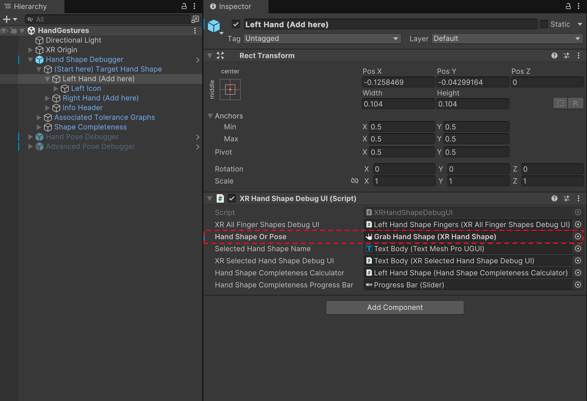
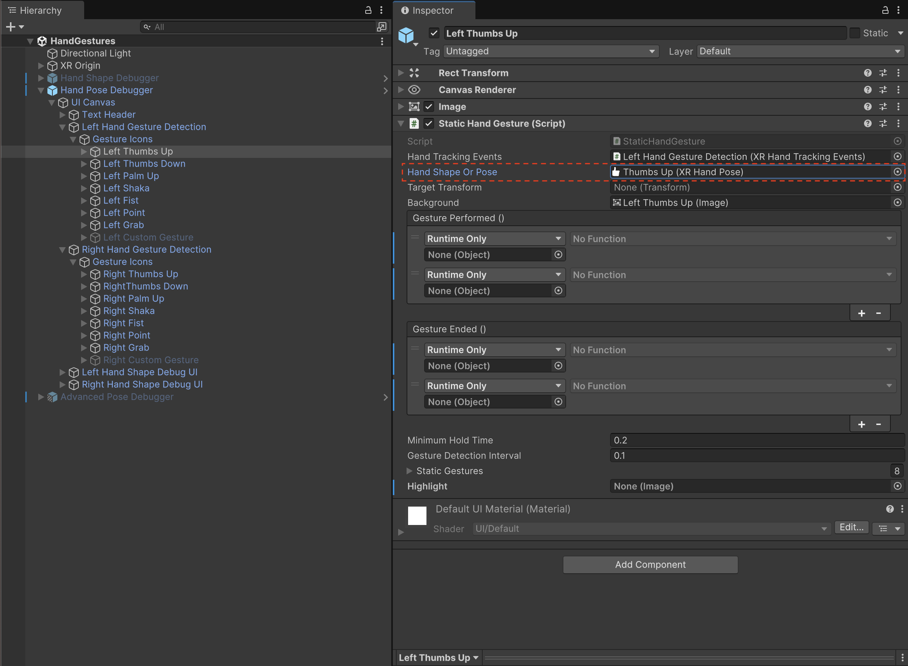
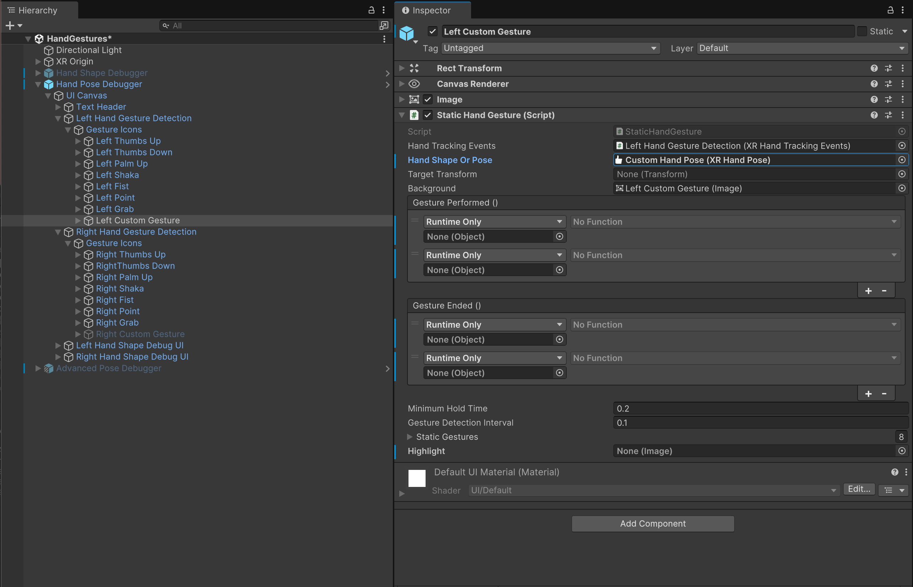
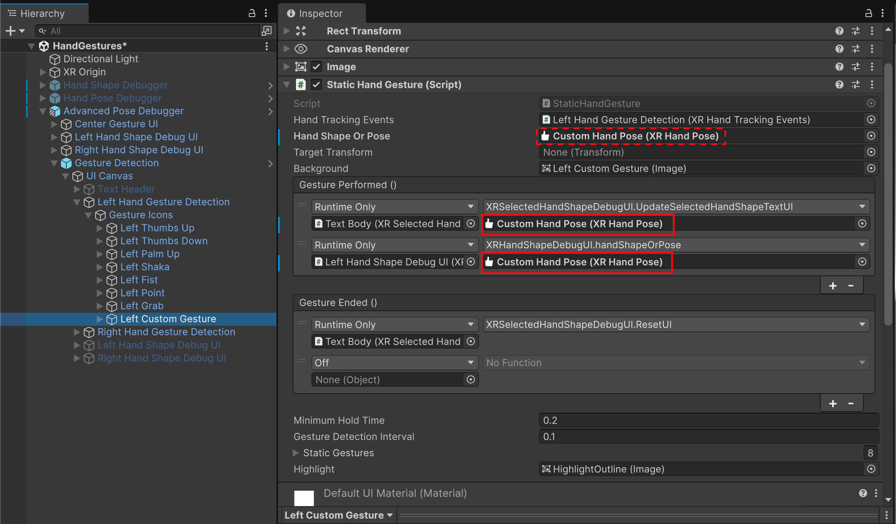

# Customize the Gesture Debugger Scene

The **HandGestures** sample scene includes three debugging tools:

- **Hand Shape Debugger**: Displays finger data graphs with target values, tolerances, and current measured values for a predefined hand shape or hand pose.
- **Hand Pose Debugger**: Displays detected hand poses for each hand. At runtime, the corresponding hand pose icon changes color when a pose is detected.
- **Advanced Pose Debugger**: Expands on the Hand Pose Debugger by not only displaying detected hand poses but also showing finger data graphs with target values and tolerance ranges for each finger shape of the current or last recognized hand shape or pose.

You can modify the scene to debug your own hand shape or hand pose.

> [!TIP]
> Ensure you have imported the **Gestures** and **HandVisualizer** samples from the XR Hands package. Refer to [Install the Gesture Debugger](xref:xrhands-install-gesture-debugger) for setup instructions.

## Configure the Hand Shape Debugger

To set the target hand shape in the Hand Shape Debugger:

1. Open the **HandGestures** scene from the **Gestures** sample in the Unity Editor.
2. In the **Hierarchy** window, enable the **Hand Shape Debugger** prefab and expand it.
3. Expand the **(Start here) Target Hand Shape** GameObject to reveal **Left Hand (Add here)** and **Right Hand (Add here)** GameObjects.
4. Select either **Left Hand (Add here)** or **Right Hand (Add here)** in the Hierarchy to open the Inspector window.
5. Assign the desired `XRHandShape` or `XRHandPose` asset to the **Hand Shape Or Pose** property of the **XR Hand Shape Debug UI** component.

   > [!Note]
   > If you assign an **XRHandPose** asset to the **Hand Shape Or Pose** property, the debugger displays its underlying **XRHandShape**. A hand pose is essentially a hand shape with orientation.

 *Setting the Hand Shape Debugger's target hand shape in the Inspector window*

   > [!TIP]
   > You can use the preconfigured `XRHandShape` assets available in `Gestures/Examples/Hand Shapes`, or [create a new XRHandShape asset](xref:xrhands-hand-shapes#create-a-hand-shape-asset) and add it to the debug scene.

## Configure the Hand Pose Debugger

The gesture detection section of the pose debugging scene contains a set of GameObjects, each configured to detect one of the sample `XRHandPose`s. You can change which hand poses can be detected, as well as adding additional hand poses to the list.

To change one of the existing hand poses to detect a different pose:

1. Open the **HandGestures** scene from the **Gestures** sample in the Unity Editor.
2. In the **Hierarchy** window, enable and expand the **Hand Pose Debugger** prefab.
3. Expand the **UI Canvas** GameObject to see the **Left Hand Gesture Detection** and **Right Hand Gesture Detection**  prefabs
4. Expand the **Left Hand Gesture Detection** or **Right Hand Gesture Detection** prefab.
5. Select the prefab corresponding to the hand pose you want to modify.
6. Assign the new `XRHandPose` asset to the **Hand Shape Or Pose** property of the **Static Hand Gesture** component.

   

7. If the hand pose requires a target relative orientation, edit the **Target Relative Orientation** properties of the **Static Hand Gesture** component.

To add an additional hand pose to be detected:

1. Open the **HandGestures** scene from the **Gestures** sample in the Unity Editor.
2. In the **Hierarchy** window, enable and expand the **Hand Pose Debugger** prefab.
3. Expand the **UI Canvas** GameObject to see the **Left Hand Gesture Detection** and **Right Hand Gesture Detection** prefabs.
4. Expand the **Left Hand Gesture Detection** or **Right Hand Gesture Detection** prefab.
5. Depending on which hand you are adding a hand pose to, duplicate the **Left Custom Gesture** or **Right Custom Gesture** prefab (which is in a disabled state).
6. Select and enable the prefab with the checkbox next to the GameObject name in the Inspector window.
7. Assign the new `XRHandPose` asset to the **Hand Shape Or Pose** property of the **Static Hand Gesture** component.

   

8. If the hand pose requires a target relative orientation, edit the **Target Relative Orientation** properties of the **Static Hand Gesture** component.
9. Locate the **Text** GameObject in the hierarchy of your new hand pose object and assign a meaningful name in the text component.

For the **Advanced Pose Debugger** only, assign your hand shape or pose asset to the **Gesture Performed** event handlers:

10. Assign the hand shape or pose asset defining the gesture to the first **Gesture Performed** event, which invokes `XRSelectedHandShapeDebugUI.UpdateSelectedHandshapeTextUI`. This event uses the name assigned to the shape or pose to update the UI text when this gesture is detected.
11. Assign the hand shape or pose asset defining the gesture to the second **Gesture Performed** event, which invokes `XRHandShapeDebugUI.handShapeOrPose`. This will populate the finger data graphs with the target values and tolerance ranges for each finger shape of the referenced hand shape or pose.
   
