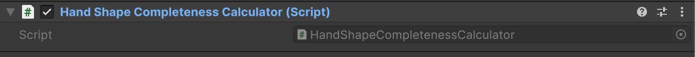
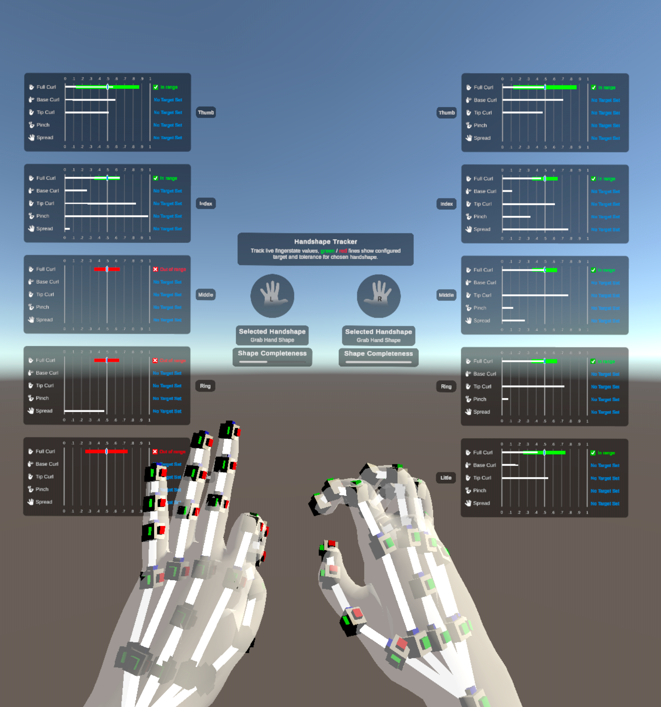
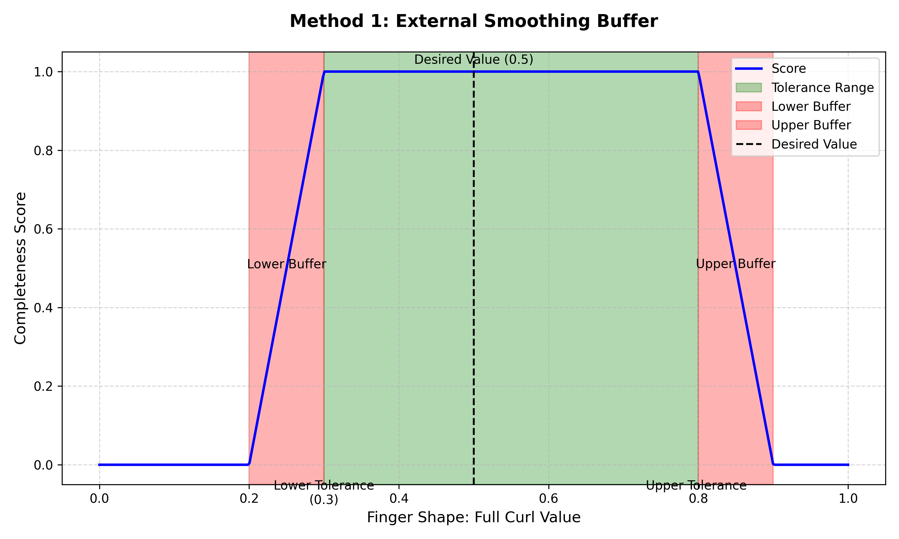

# Hand Shape Completeness Calculator Component

The **Hand Shape Completeness Calculator** component evaluates how closely the current hand shape matches a predefined target [hand shape](xref:xrhands-hand-shapes).

<br/>*The Hand Shape Completeness Calculator component*

The completeness calculation is based on comparing the current detected finger shapes with each [finger shape condition target](xref:UnityEngine.XR.Hands.Gestures.XRFingerShapeCondition.Target) defined for the desired hand shape. A finger shape condition is considered met if the detected finger shape value falls within the tolerance range defined by:

`[desired value - lower tolerance, desired value + upper tolerance]`

The hand shape completeness score, ranging from 0.0 to 1.0, represents the average accuracy of all finger shape conditions.

* 1.0: All finger shape conditions are met, indicating a perfect match.
* 0.0: None of the conditions are met, indicating no match.

This score is used to update the progress bar UI in the [Hand Shape Completeness Debugger](xref:xrhands-understand-gesture-debugger#handshape-debug-panel--hand-shape-completeness-debugger).

<br/>*The progress bar shows the left hand performing an incomplete grab shape and the right hand performing a full grab shape.*

> [!IMPORTANT]
> You must import the **Gestures** sample provided by the XR Hands package to use the **Hand Shape Completeness Calculator** component. Refer to [Samples](xref:xrhands-manual#samples) for instructions.

## Add Hand Shape Completeness Calculator Component

To use the **Hand Shape Completeness Calculator** component, follow these steps:

1. **Set Up the XR Scene**

   Ensure your XR scene is configured with an **XR Origin**. For guidance, please refer to [Scene Setup](xref:xrhands-scene-setup).

2. **Add the Calculator Component**

   Create a new GameObject in your scene and attach the **Hand Shape Completeness Calculator** component to it.

3. **Reference the Calculator Component and Target Hand Shape**

   Create a test script. In this script:
   - Add a reference to the **Hand Shape Completeness Calculator** component.
   - Add a reference to the target **Hand Shape** asset.

4. **Calculate the Completeness Score**

   Use the `TryCalculateHandShapeCompletenessScore` method in your script to calculate the hand shape completeness score. Example:

   ```csharp
      [SerializeField]
      HandShapeCompletenessCalculator m_HandShapeCompletenessCalculator;

      [SerializeField]
      XRHandShape m_HandShape;

      // ...
      void Update()
      {
         // ...
         var handShapeCompletenessScore = 0f;

         if (hand.isTracked && m_HandShapeCompletenessCalculator.TryCalculateHandShapeCompletenessScore(
            hand, m_HandShape, out handShapeCompletenessScore))
         {
            // ...
         }
      }
   ```

   Refer to the `XRHandShapeDebugUI` script in the `Gestures` sample for a complete example of how the calculator is implemented in the sample scene.

## Customize the Completeness Calculation Method

To prevent abrupt changes in the completeness score near the boundaries of the valid condition range, you can apply smoothing techniques. These techniques ensure smoother transitions and avoid sudden jumps in the score.

Two smoothing methods are demonstrated in the `HandShapeCompletenessCalculator` script in the `Gestures` sample:

* `CalculateScoreWithExternalBuffer`: Uses a smoothing buffer outside the tolerance range to adjust the score gradually. This is the default smoothing method used in the sample code.
  > [!NOTE]
  > The plot below demonstrates the external buffer method for smoothing the completeness score using linear interpolation. The target finger shape condition has a desired value of 0.5, with a lower tolerance of 0.2, and an upper tolerance of 0.3. External buffer size is set to 0.1 in the example.

   <br/>*External smoothing buffers refine completeness scores for smoother transitions*
<br/>

* `CalculateScoreWithInternalBuffer`: Smooths the score based on values within the tolerance range.

  > [!NOTE]
  > The plot below demonstrates the internal buffer method for smoothing the completeness score using linear interpolation. The target finger shape condition has a desired value of 0.5, with a lower tolerance of 0.2 and an upper tolerance of 0.3.

   <br/>*Internal smoothing buffers refine completeness scores for smoother transitions*

These examples provide flexibility, allowing you to select or customize the approach that best fits your requirements.
