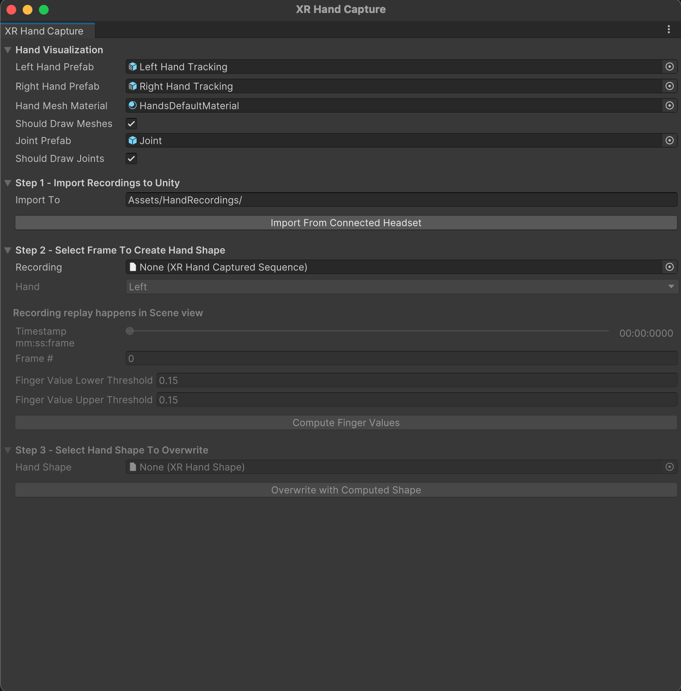
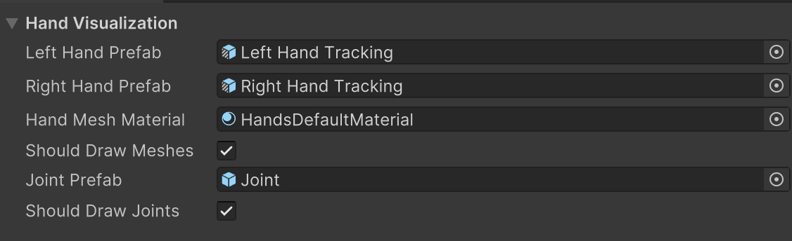
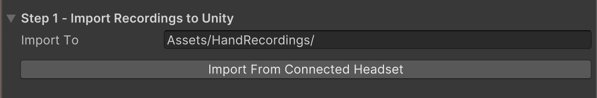
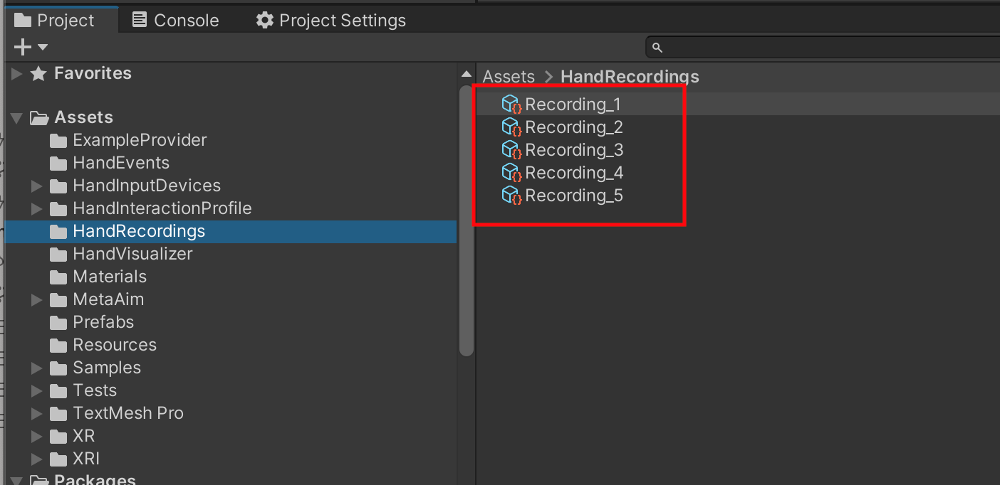
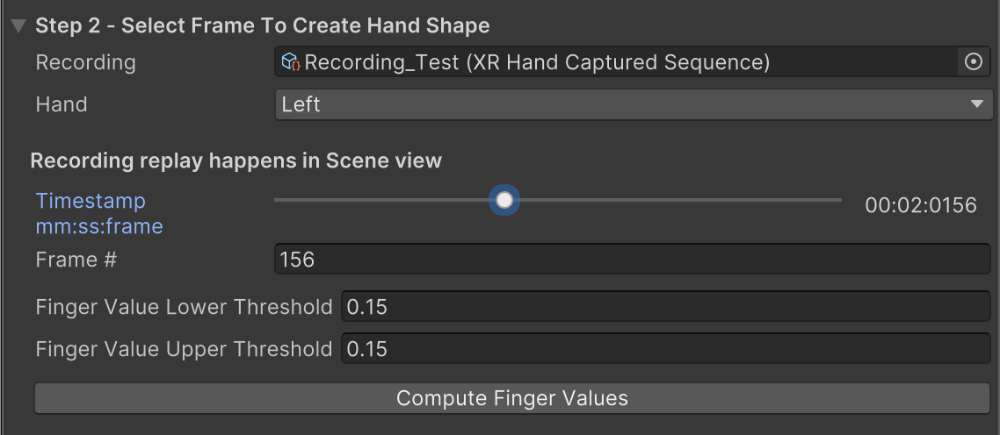
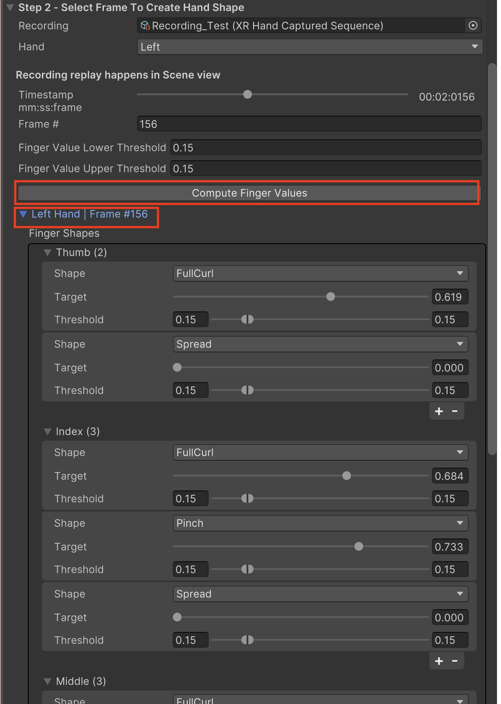
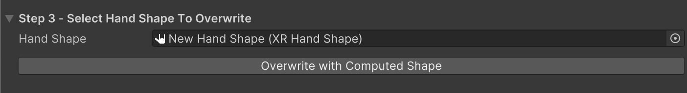

# Generate XRHandShape Assets from Hand Recordings

Once you have [recorded hand data](xref:xrhands-xrhandcapture-recording) on your XR device, you can import and process these recordings within the Unity Editor to create custom **XRHandShape** assets.

## Import and Process Recordings in Unity

### Open the XR Hand Capture Window

In Unity, navigate to: `Window > XR > XR Hand Capture`

  

### Hand Visualization Settings

The hand visualization fields are pre-populated with default settings to render hands in the scene view during playback. You can use these defaults without making any changes.

  

- **Left Hand Prefab:** Uses the `Left Hand Tracking` prefab from the Hand Visualizer sample by default.
- **Right Hand Prefab:** Uses the `Right Hand Tracking` prefab from the Hand Visualizer sample by default.
- **Hand Mesh Material:** Uses the `HandsDefaultMaterial` from the Hand Visualizer sample by default.
- **Joint Prefab:** Uses the `Joint` prefab from the Hand Visualizer sample by default.
- **Should Draw Meshes:** When enabled, hand meshes are rendered in the scene view during playback.
- **Should Draw Joints:** When enabled, hand joints are rendered in the scene view during playback.

### Import Recordings to Unity

  

1. Connect your XR device to the development machine.
    > [!NOTE]
    > Currently, the XR Hand Capture window will not recognize your XR device unless the Build Target is set to **Android**.

2. In the XR Hand Capture Editor window, click **Import From Connected Headset** to import all recordings from the connected device.

Imported recordings are saved to `Assets/Hand Recordings` by default. If the folder does not exist, it will be created automatically. You may change the save path if desired.

> [!Tip]
> To avoid duplicate imports, delete imported or unwanted recordings from the headset using the delete icon in the recording app.
> If a recording with the same name already exists in the save path, a suffix will be appended to the new recording to differentiate it.

### Select Frame to Create Hand Shape

  

1. Choose a recording from your imported list. Further steps will be unavailable until a recording is selected.
2. Use the timeline slider to browse through frames and locate your desired hand pose. The captured hand will be displayed in the **scene view**.
    > [!Tip]
    > If you can’t see the playback hands in the Scene view, it may be because the view is zoomed out or focused elsewhere. To quickly locate the hands, open the Hand Capture sample scene, select the **XR Origin Hands**, and press **F** to focus the view on it.

3. Select **Left** or **Right** hand for shape extraction.
4. Click **Compute Finger Values** button to analyze the selected hand pose:
    1. Expand the foldout to view and adjust [XRHandShape properties](xref:xrhands-hand-shapes).
          
    2. Fine-tune finger shape target values and thresholds for gesture recognition.
    3. Add or remove finger shape targets as needed.

Default finger shape target threshold value is `0.15` (higher values allow for more lenient gesture recognition).

### Save or Overwrite Hand Shape Asset

1. Select an **XRHandShape** asset to save the newly computed hand pose data.
    > [!Tip]
    > To create a new XRHandShape asset, go to `Assets > Create > XR > Hand Interactions > Hand Shape` in the Editor Assets menu. For more details, refer to the [XRHandShape asset documentation]((xref:xrhands-hand-shapes#create-a-hand-shape-asset)).

2. Click **Overwrite with Computed Shape** to save the hand shape data into the selected XRHandShape asset.

---

### Test Your Generated XRHandShape Assets

To test your newly created **XRHandShape** assets, use the **Hand Shape Debugger** in the Gestures sample.

For setup instructions, please refer to the [Hand Shape Debugger documentation](xref:xrhands-customize-gesture-debugger).
