# Record Hand Data with Hand Capture Sample

The **Hand Capture** sample makes it easy to record custom hand data directly on your XR device. This guide walks you through setting up your project, configuring dependencies, and using the in-headset interface to capture and manage hand recordings.

### Getting Started

**1. Import the XR Hands Package**
Ensure you have the XR Hands package (**v1.7.0 or newer**) [installed](xref:xrhands-install) via Unity Package Manager.

**2. Import the Hand Capture Sample**
In the Package Manager, locate the XR Hands package and import the **Hand Capture** sample: `Menu: Window > Package Manager > XR Hands > Samples > Hand Capture > Import`

**3. Install and Configure Dependencies**
To use the Hand Capture sample, install the following packages (use **Fix** in `Edit > Project Settings > XR Plug-in Management > Project Validation`, or install via Package Manager):

- **XR Interaction Toolkit** (`com.unity.xr.interaction.toolkit`, v3.2.0 or newer). See [Install XR Interaction Toolkit](https://docs.unity3d.com/Packages/com.unity.xr.interaction.toolkit@latest?subfolder=/manual/index.html) for installation steps. Also import the following XRI samples:

  - [Starter Assets](https://docs.unity3d.com/Packages/com.unity.xr.interaction.toolkit@latest?subfolder=/manual/samples-starter-assets.html)
  - [Hands Interaction Demo](https://docs.unity3d.com/Packages/com.unity.xr.interaction.toolkit@latest?subfolder=/manual/samples-hands-interaction-demo.html)
  - [Spatial Keyboard](https://docs.unity3d.com/Packages/com.unity.xr.interaction.toolkit@latest?subfolder=/manual/samples-spatial-keyboard.html)

  > [!IMPORTANT]
  > There is a known issue when upgrading from an older version of XRI sample to a newer version. Script references in the demo scene for scripts included in the demos become disconnected when upgrading in-place.
  > **Recommendation:** Delete existing XRI demo folders from your Samples directory before importing the new XRI samples.

- **Hand Visualizer** sample from the XR Hands package

- **OpenXR Plugin** ([com.unity.xr.openxr](https://docs.unity3d.com/Packages/com.unity.xr.openxr@latest/?subfolder=/manual/index.html), v1.11.0 or newer)

- **TextMesh Pro and TMP Essential Resources**
  - After installing [TextMesh Pro](https://docs.unity3d.com/Packages/com.unity.ugui@latest?subfolder=/manual/TextMeshPro/index.html), import TMP Essential Resources:
    `Window > TextMeshPro > Import TMP Essential Resources`

**4. Open the Sample Scene**
Navigate to: `Assets/Samples/XR Hands/[version]/Hands Capture/HandCapture.unity`

  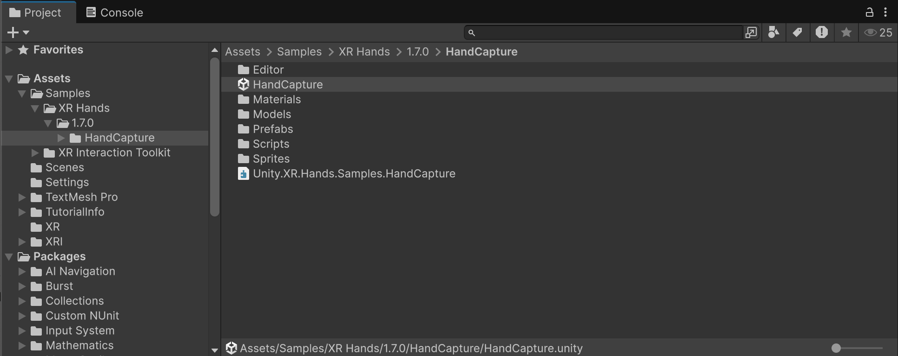

**5. Configure Project Settings**

* **Enable Hand Tracking OpenXR:**
  To enable hand tracking support with an OpenXR project, enable the **OpenXR** Plug-in Provider in **Edit > Project Settings > XR Plug-in Management**.
  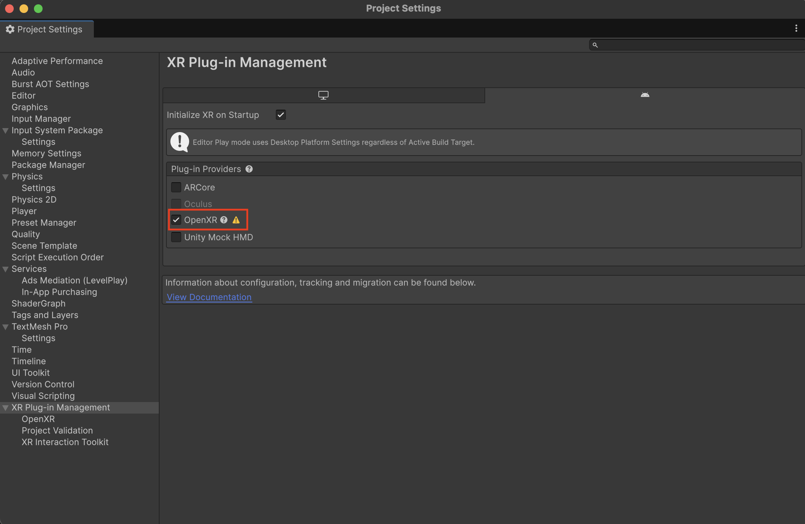

* **Enable Hand Tracking Subsystem:**
  Then open `Edit > Project Settings > XR Plug-in Management > OpenXR` and enable **Hand Tracking Subsystem** under OpenXR Feature Groups

  - **Meta Quest Support via OpenXR:**

    If building for Meta Quest headsets, you will also need to enable **Meta Quest Support** (only available in the **Android** tab) and **Meta Hand Tracking Aim**. Then add an **Interaction Profile** in that same window, such as **Oculus Touch Controller Profile**, for controller support.

    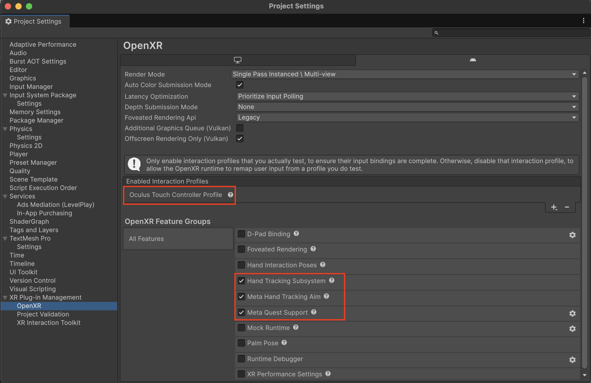

**6. Build and Deploy**

- Open `File > Build Settings` and select the Hand Capture scene to build to your device
  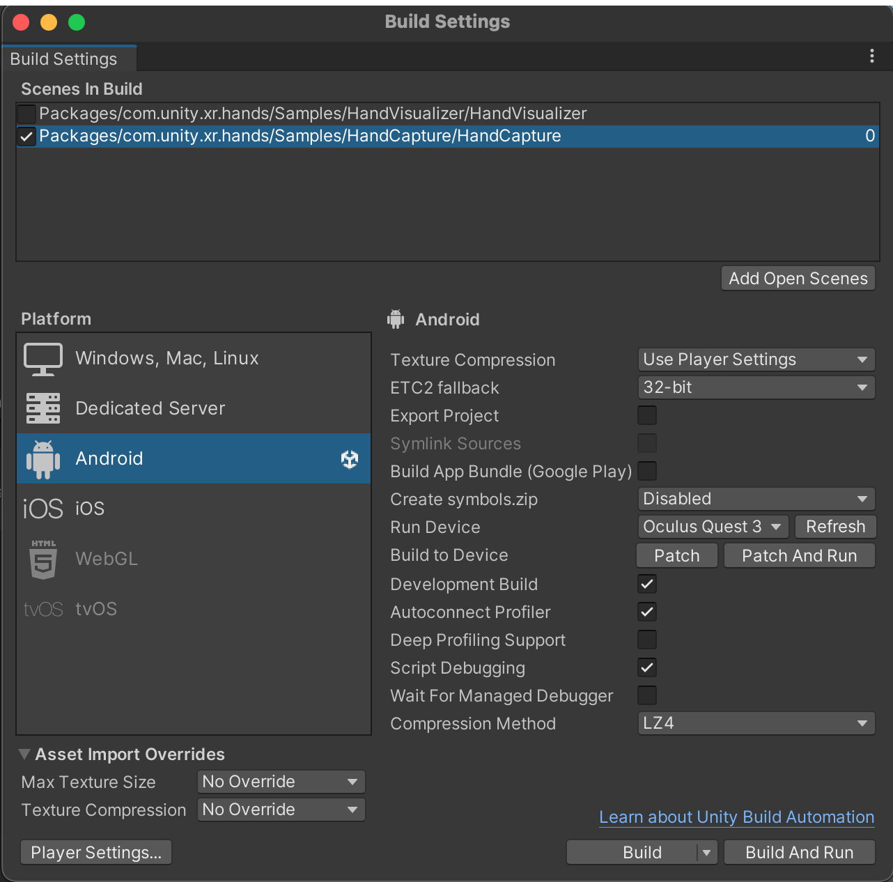
- Deploy and launch the app on your XR device

**7. Import Recordings into the Editor**
After recording hand data on your device, import the recordings into the Unity Editor by following [these steps](xref:xrhands-xrhandcapture-playback). You can then review the captured data, select your desired hand shape, and create new **XRHandShape** assets.

---

### Using the Hand Capture Sample Scene

The in-headset UI guides you through the recording process:

- **Instruction Panel**
  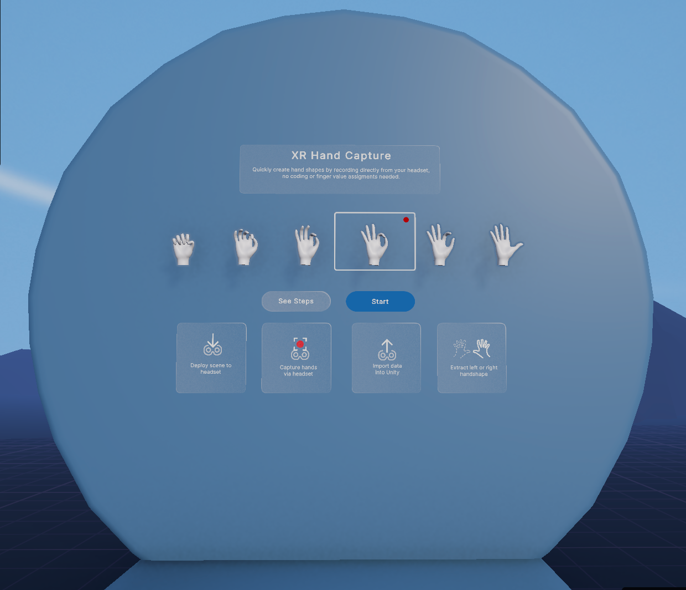
  - Use **See Steps** for detailed instructions
  - Press **Start** to prepare for recording
- **Ready To Record Panel**
  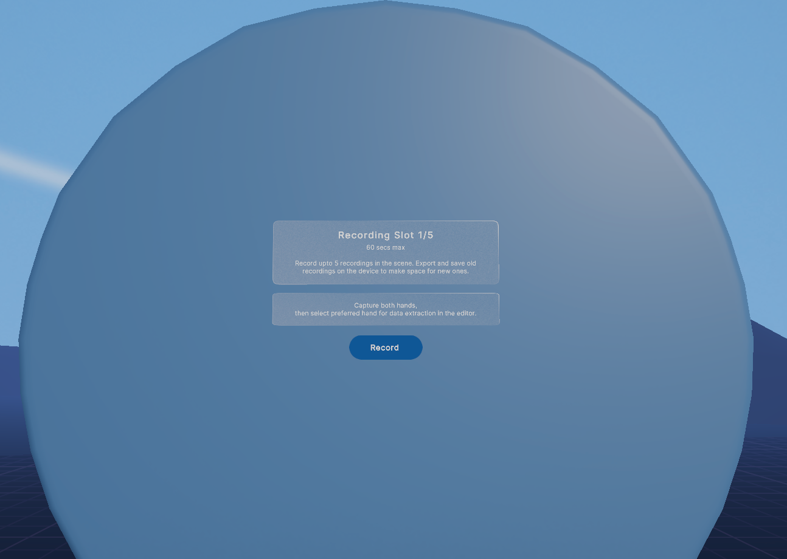
  - Displays the current recording slot (e.g., "Recording Slot 1/5")
  - Press **Record** to start capturing hand data
- **Recording Panel**
  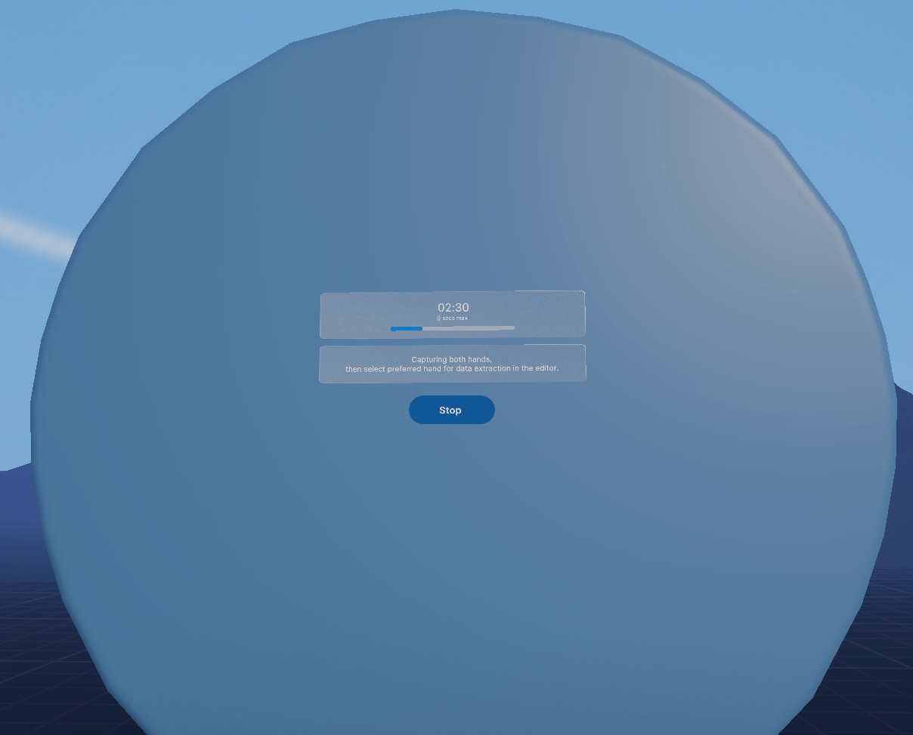
  - Shows progress bar and timer (up to 60 seconds)
  - Press **Stop** or wait for timer to finish
- **Stop Recording Panel**
  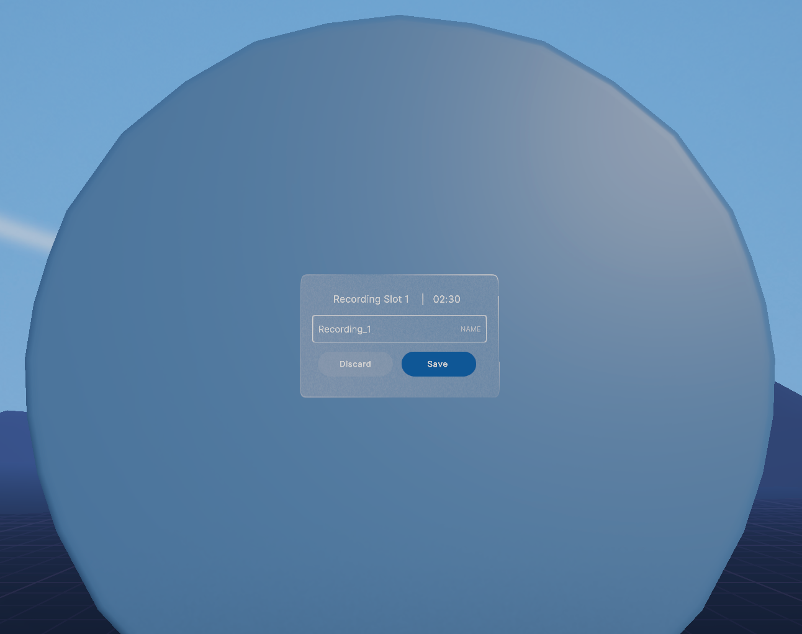
  - Name your recording or use the default ("Recording_1", "Recording_2", etc.)
  - **Save** or **Delete** the recording
- **Saved Recording Panel**
  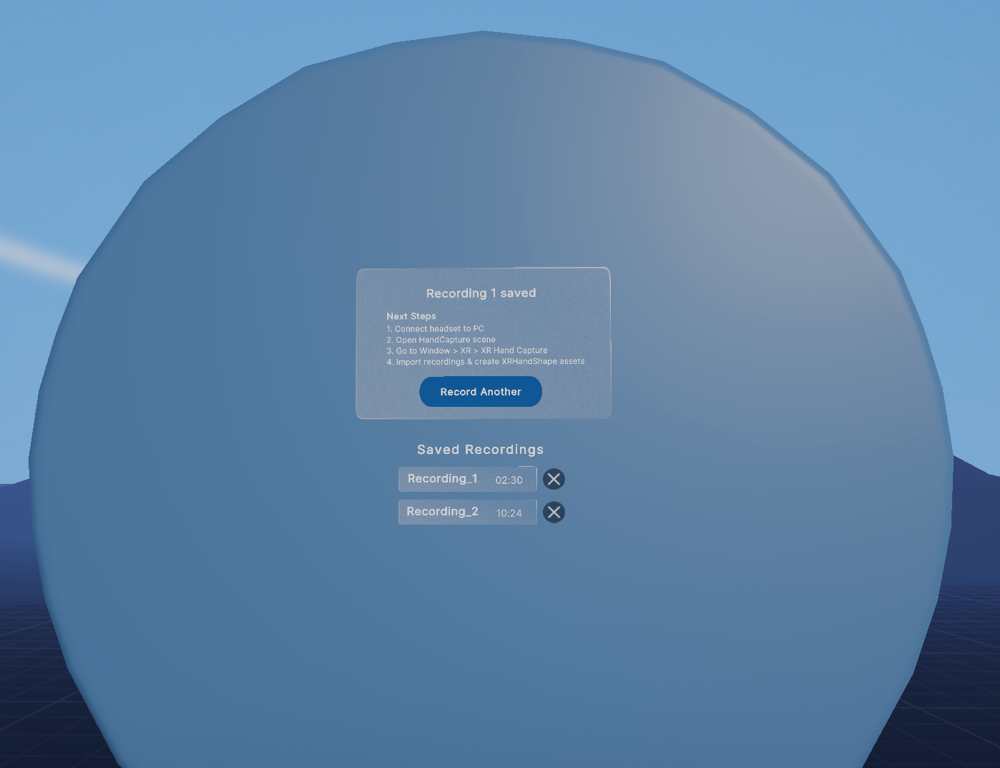
  - View saved recordings
  - Delete unwanted recordings with the delete icon
  - Start a new recording (if slots are available)
  - If storage is full, delete recordings to free up space

---

### Notes

- The sample provides **5** recording slots, each capable of storing up to **60** seconds of hand pose data.
- **New recordings cannot be made if all slots are occupied.** To free up slots, import existing recordings into the Unity Editor and delete them from the device.
- Recording slots are automatically managed. The system assigns the next available slot for each new recording.
- **Recordings are persistent** in the "Saved Recordings" list, remaining available even after closing and reopening the application. They will only be removed if:
  - Manually deleted using the delete icon within the app, or
  - The application is uninstalled.
- **Default naming convention:** Recordings are named `Recording_{index}`, with the index automatically incremented for each new recording.
  - When the app is reopened, the system continues incrementing the index from the highest index of previous sessions.
  - **To reset the index to 1:** Delete all recordings and restart the application.

---

### Best Practices & Recommendations

- For best results, record with your palm facing the camera for detailed finger capture.
- Delete unwanted recordings regularly to maintain device storage.

---

### Troubleshooting

If you find yourself in an error state after importing the sample, it can be helpful to use section below to identify the issue and take the appropriate steps to correct them.

#### Missing Dependencies

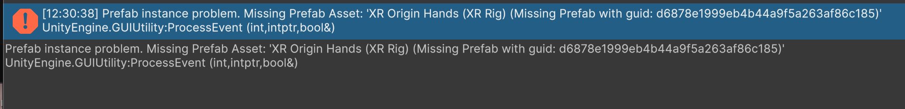

The above error will happen if you have not imported required samples from the **XR Interaction Toolkit** package. Once imported, these errors should be cleared. You can navigate to **Project Validation** in XR Plug-in Management to see what might be missing. Clicking **Fix** will import the main package.

  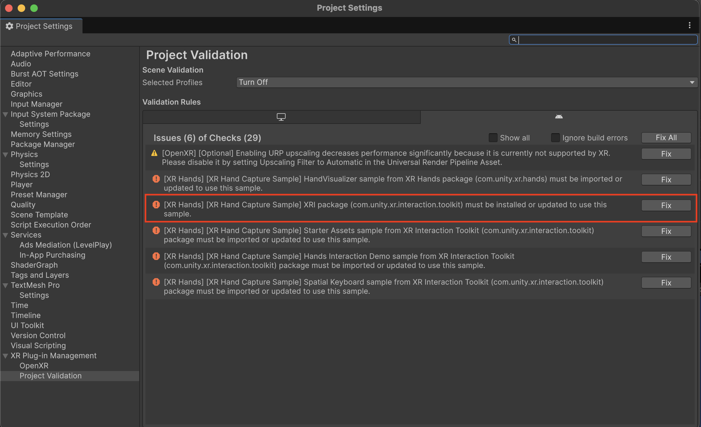

If the XR Interaction Toolkit package has not been imported, you will also need to import the **Starter Assets sample**, **Hands Interaction Demo sample**, and **Spatial Keyboard sample** by clicking **Fix** as shown in the image below:

  > [!IMPORTANT]
  > There is a known issue when upgrading from an older version of XRI sample to a newer version. Script references in the demo scene for scripts included in the demos become disconnected when upgrading in-place.
  > **Recommendation:** Delete existing XRI demo folders from your Samples directory before importing the new XRI samples.

  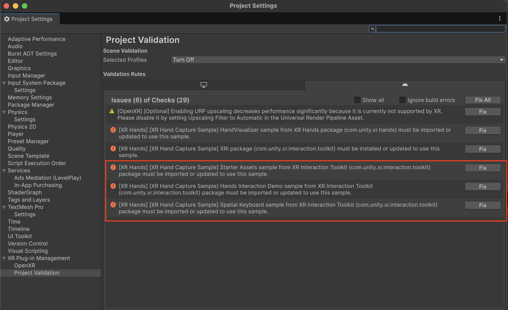

The missing prefab error might also occur if you have not imported the **Hand Visualizer** from the **XR Hands** Samples first. Once imported, these errors should be cleared. You can navigate to **Project Validation** in XR Plug-in Management to see this error as well (see image below). Clicking **Fix** will import the **Hand Visualizer** for you.

  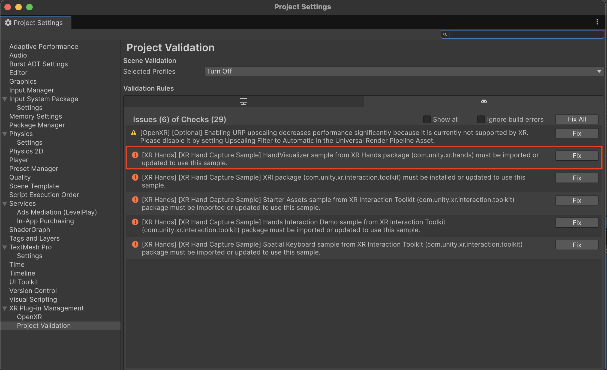

#### Incorrect Scene Appearance

* If the sample scene appears incorrectly or displays missing materials, it may be due to the project using a Scriptable Render Pipeline (URP or HDRP), while some materials in the sample scene is designed for the Built-in Render Pipeline.

  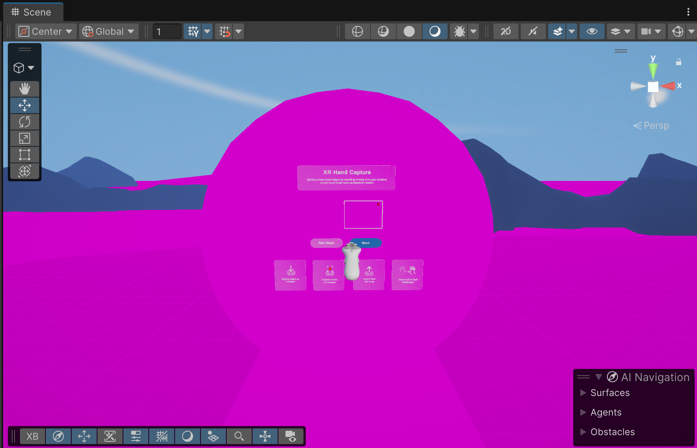

  **Solution:** If you haven't already, import the **Hand Visualizer** sample. It includes a script that automatically converts materials for compatibility with the Universal Render Pipeline (URP).

* If you encounter double-vision artifacts (such as raycast tear drops), this is a [known limitation](https://docs.unity3d.com/Packages/com.unity.xr.interaction.toolkit@latest?subfolder=/manual/index.html#known-limitations) when using Shader Graph shaders on the Built-in Render Pipeline.

  **Solution**: If your project uses the Built-in Render Pipeline, you can avoid the problem by taking one of the following actions:

  * Switch to [multi-pass rendering](xref:SinglePassStereoRendering). (Performance of multi-pass rendering is typically much worse than single-pass.)
  * Change the problematic Materials to use non-Shader Graph shaders.
  * Update the project to use the Universal Render Pipeline (URP).
