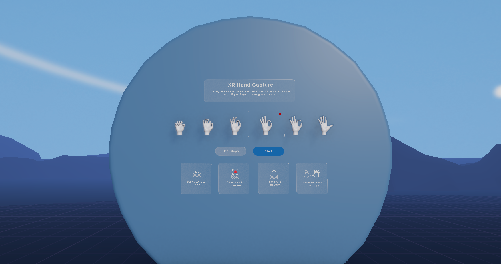
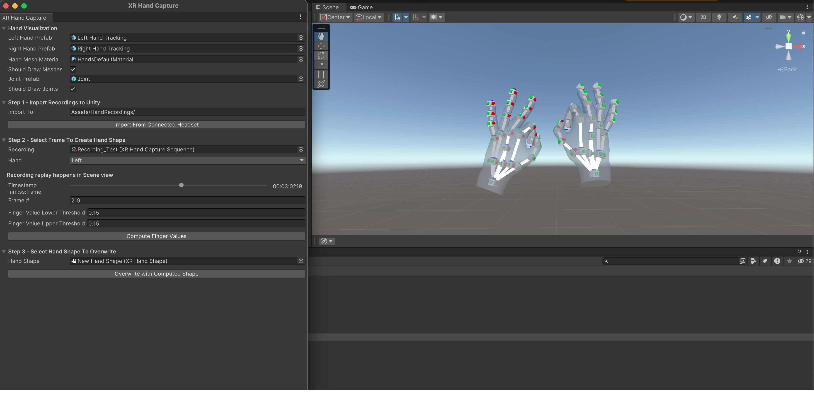

# XR Hand Capture

**XR Hand Capture** enables developers to quickly create custom hand shapes for XR applications. With this feature, you can record hand data on supported XR devices, import the recordings into the Unity Editor, and create reusable [XRHandShape](xref:xrhands-hand-shapes) assets. This streamlined workflow accelerates gesture-based interaction development, making it simple to add custom hand gestures to your Unity projects.

### Workflow Overview

The XR Hand Capture workflow consists of two main stages:

- **Recording:** Use the [Hand Capture sample scene](xref:xrhands-xrhandcapture-recording) on your XR device to capture hand data in real-time.

- **Asset Generation:** [Import your hand recordings](xref:xrhands-xrhandcapture-playback) into the Unity Editor, then use the **XRHandCapture** window to review, select, and generate **XRHandShape** assets from your captured data.

    
